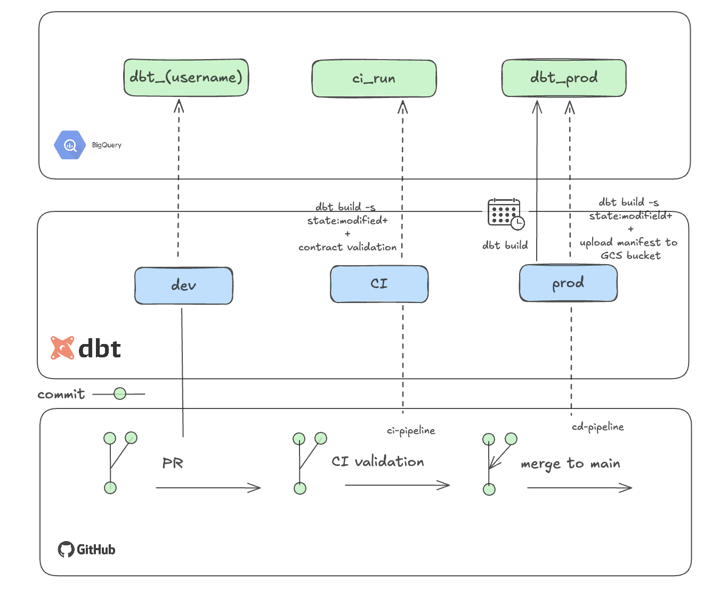

## 🚀 CI/CD Workflows for dbt Project

This project uses GitHub Actions to automate CI/CD processes for deploying and validating dbt models in BigQuery. There are two main workflows:

---

### ✅ Continuous Integration (CI)

**File:** `.github/workflows/ci-pipeline.yml`  
**Trigger:** On pull requests to the `main` branch or manual execution (the latter for debugging purposes).

**Purpose:** Validate changes to the dbt project before merging into production.

#### Steps:

1. **Checkout Code** – Retrieves the code from the pull request.
2. **Set Up Python** – Initializes Python 3.10 for dbt and contract validation scripts.
3. **Virtual Environment** – Creates and activates a virtualenv.
4. **Install Dependencies** – Installs Python packages including dbt.
5. **Set Up Service Account** – Decrypts the GCP service account key into the environment.
6. **Generate CI Dataset Name** – Creates a unique dataset name for this run.
7. **Authenticate with GCP** – Uses the SA key to authenticate CLI actions.
8. **Install dbt Packages** – Runs `dbt deps` to install project dependencies.
9. **Run dbt Build** – Builds the project using a temporary, clean dataset via `--empty`.
10. **List Datasets** – Logs current BQ datasets (for diagnostics).
11. **Clean Up CI Datasets** – Removes any temporary datasets created during CI.

#### 🧠 Future Improvements:

- Use `dbt build -s state:modified+` to improve performance by building only changed models and their dependencies.
- Add a validation step to check that `procurements_page` and `company_profile_page` match `contracts/output_contract.yaml`.

---

### 🚢 Continuous Deployment (CD)

**File:** `.github/workflows/cd-dbt-build-upload-manifest.yml`  
**Trigger:** On push to `main` or manual execution

**Purpose:** Deploy production dbt models and archive metadata artifacts.

#### Steps:

1. **Checkout Repository** – Retrieves the latest `main` code.
2. **Set Up Python** – Installs Python 3.10.
3. **Install Dependencies** – Installs dbt and other dependencies.
4. **Install dbt Packages** – Executes `dbt deps`.
5. **Set Up Service Account** – Authenticates using `GCP_SA_KEY` for GCP access.
6. **Run dbt Build (prod)** – Runs `dbt build --target prod` to populate production BQ tables.
7. **Upload Manifest** – Pushes the `manifest.json` file to GCS: `gs://datenna-assessment/dbt_artifacts/manifest.json`

---

### 🔐 Secrets & Variables

- `GCP_PROJECT_ID` – Project ID (set as a repository variable)
- `GCP_SA_KEY` – GCP Service Account Key in JSON format (stored as a secret)

---

### ✅ Summary Table

| Workflow | Purpose              | Trigger              | Key Output                          |
|----------|----------------------|----------------------|-------------------------------------|
| CI       | Validate PR changes  | PR to `main`, manual | Isolated build + dataset cleanup    |
| CD       | Deploy to production | Merge to `main`, manual | Production build + manifest upload |

---

## 🧠 Ideal Design
As mentioned in **Future Improvements**, the current workflow differs from an ideal state, designed as:
. 
However, given the size of the data and the purpose of this assignment, the CI/CD workflow currently used works well for demonstration purposes.

---

