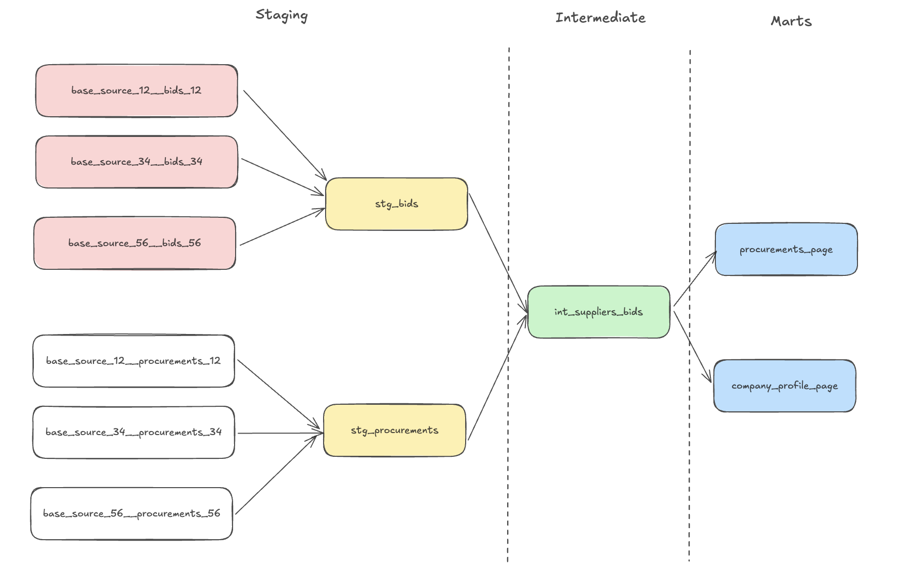

# dbt Procurement Pipeline

This dbt project transforms procurement and bid data from multiple JSONL sources into output tables that power two key user-facing features in the Datenna platform:

1. **Procurements Page** – page with all relevant procurements, displays procurement opportunities and winners.
2. **Company Profile Page** – enriches company pages with all procurements a supplier participated on, and wins.

---

## 📦 Overview

This pipeline handles data from several sources (e.g., source 12, 34, 56), loaded via validated JSONL files into BigQuery. 

The data is transformed in dbt using a `staging → intermediate → marts` layer structure to meet platform-specific data quality and usability requirements.

---

## ✅ Output Tables

### 1. `procurements_page`
- One row per procurement.
- Fields:
  - Procurement title (cleaned)
  - Publish date
  - Buyer
  - Number of bids
  - Winner supplier name
  - Winner bid value
- **Use case:** feeds the procurement search UI on the platform.

### 2. `company_profile_page`
- One row per bid.
- Fields:
  - Supplier
  - Procurement metadata (title, publish date, buyer)
  - Value amount and currency
  - `is_winner` boolean
- **Use case:** enriches the profile of each company with all bids submitted, highlighting wins.

The ** contract for the output** can be found in the data_contracts folder.
---

## 🛠 Project Structure

- **`base_*`**: 1:1 base models with the source, to be unioned later (e.g., `base_source_12__bids_12`)
- **`stg_*`**: Union base models (e.g., `stg_bids`, `stg_procurements`)
- **`int_*`**: Join and enrich logic (e.g., `int_suppliers_bids`)
- **`marts/*`**: Final models used for downstream consuption
  - `procurements_page.sql`
  - `company_profile_page.sql`

This structure is based on [dbt's project structure best practices](https://docs.getdbt.com/best-practices/how-we-structure/1-guide-overview).

---

## 📌 Key Business Rules Enforced

- All procurements must have a non-null, cleaned title (titles with ID patterns like `"1-560"` are excluded).
- All bids must have a non-null supplier and bid value.
- Bid `value` strings are split into:
  - `value_amount`: numeric
  - `currency`: symbol
- Bids without a numeric `value_amount` are filtered out.
- The winner per procurement is flagged using a window function (`row_number` over lowest bid amount).

---

## ⚙️ Configuration

- Final `company_profile_page` table is **clustered by `supplier`** to optimize filter performance in BigQuery.
- Documentation is persisted to BigQuery using `persist_docs`.

---

## 🧠 Assumptions

- A procurement is considered **won by the bid with the lowest non-null value**.
- Title cleaning assumes any title starting with a pattern like `1-560` or similar ID codes is not meaningful for users and is excluded.
- Bids with missing or unparsable `value` fields are dropped at the staging level.
- All sources are structurally aligned (contract-compliant) before dbt processing.
- `publish_date` is parsed from varying formats (e.g., `MM/DD/YYYY`), and invalid ones are dropped upstream or handled during staging.

---

## 🧪 Tests and Validation

- Column-level tests for:
  - Not null constraints (e.g., `supplier`, `procurement_number`)
  - Regex validation for cleaned titles
- Primary keys defined per model for uniqueness and integrity, for int model due to join operation.
- Schema descriptions and column docs persisted to BigQuery

---

## 🚀 How to Run

```bash
dbt deps       # install packages, such as dbt_utils and dbt_expectations
dbt build      # run and tests models
dbt docs generate # generate documentation
dbt docs serve # view documentation

